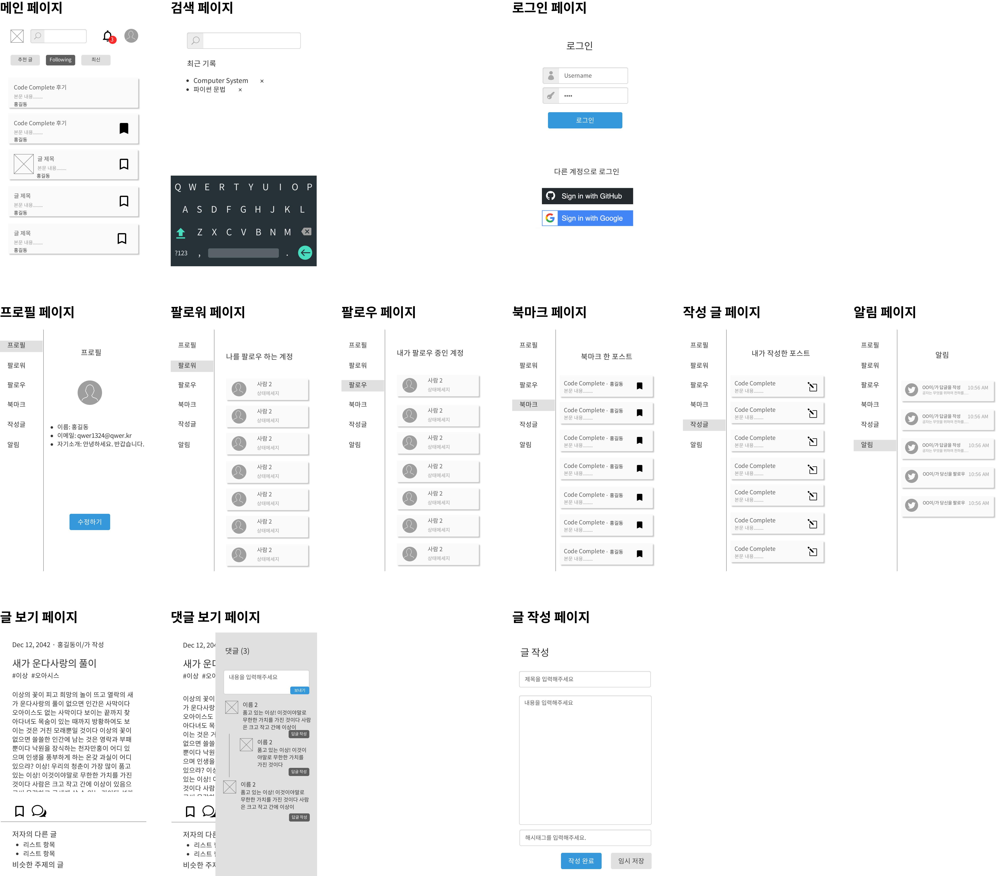
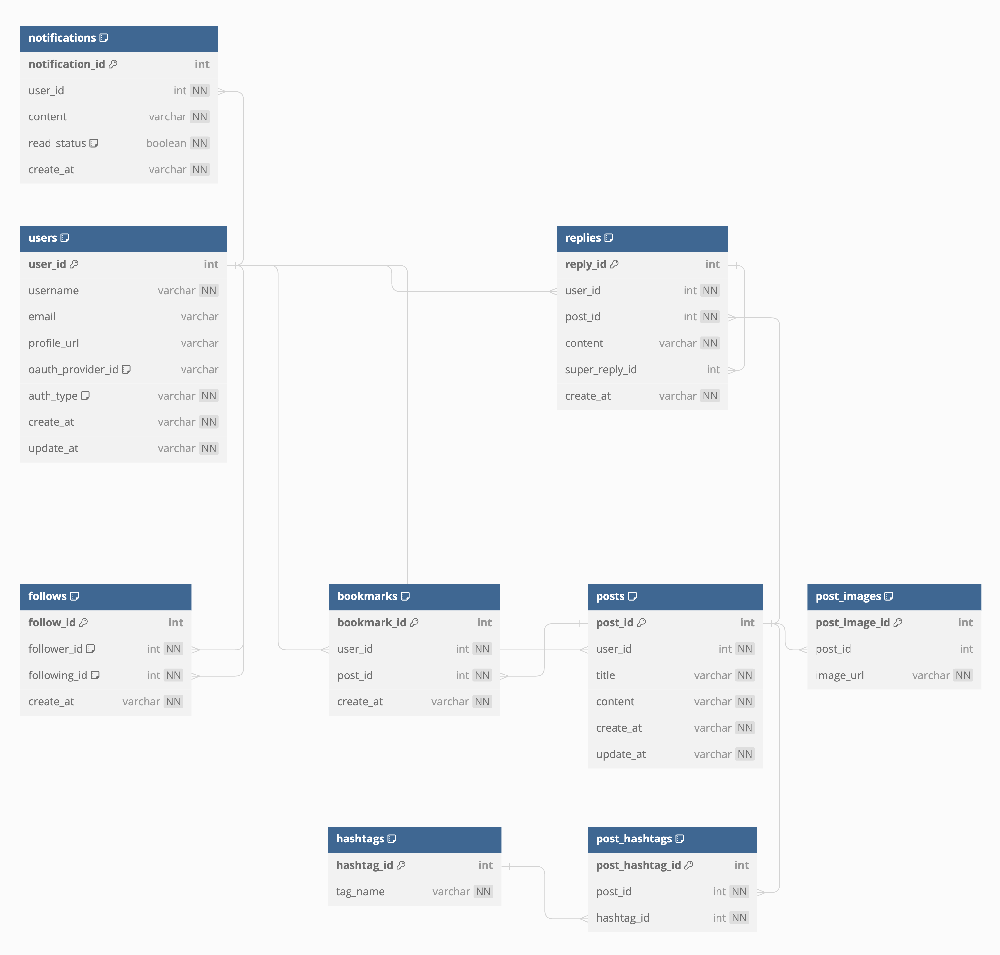

- - -

프로젝트 개발 이후 2주차 화상 멘토링 전에 준비한 내용을 정리하였습니다.

# 서비스 구상

결과적으로 [velog](https://velog.io/) 서비스의 기능을 참고하여 API를 제공하는 Backend 프로젝트를 만들기로 했다.

이름은 clone + velog 해서 celog로 정했다.

모든 기능을 동일하게 가져가는 것은 아니고, 기능이나 구현에 어느정도 차이는 있다.
(실제 예시: velog의 시리즈 기능은 실제로 서비스를 사용하는 입장에서 매력적인 기능이였지만, 트래픽에 큰 연관이 없고 구현을 복잡하게 하는 것 같아 구현하지 않는다.)

왜 velog인가?
1. 블로그 서비스 중에는 많은 기능을 사용해 본 서비스이다.
2. 상대적으로 다른 블로그에 비해 기능이 단순하다.
3. 1인 개발 서비스라서 규모나 복잡도 면에서 조건으로 삼기 좋았다.

## 기능 정리

celog가 구현할 기능을 정리했다. (velog의 기능이 아니다.)

구체적인 기능 명세보다는 착각하기 쉽거나 구현할 기능의 범위를 제한하는 정도로 정리했다.

- 글-POST
	- 글 본문과 이미지를 올릴 수 있다. - 파일은 불가능하다.
- 계정/사용자 - USER
	- OAuth 또는 Email Verification 기반 로그인/회원가입을 제공한다.
		- **참고: [Email OTP vs Email Verification: What's the Difference?](https://fazpass.com/blog/authentication/email-otp-vs-email-verification/)**
- 댓글 - REPLY
	- 글에 댓글을 달 수 있다.
	- 댓글에 댓글을 달 수 있다.
- 팔로우 - FOLLOW
	- 어떤 사람(USER)을 팔로우할 수 있다.
- 북마크 - BookMark
	- 어떤 글(POST) 북마크하고 찾아볼 수 있다.
	- 사용자는 본인이 북마크한 글을 확인할 수 있다.
- 게시글 해시태그 - HashTag
	- 어떤 글(POST)에 해시태그 등록할 수 있고, 해시태크를 사용하는 글을 찾을 수도 있다.
- 알림 - notification 
	- 어떠한 사용자에 대한 알림이다.
	- 읽으면 읽음 표시가 된다.
	- 누군가 본인의 글에 북마크를 하거나 본인을 팔로우하는 등, 여러 이벤트 발생 시 알림이 온다.

## 프로토타입 디자인

위의 기능을 기준으로 프로토타입을 디자인하였다.

[kakao oven](https://ovenapp.io/view/SuEVqgcBEXPsejjnk4G57VIqwCOsbqPf)에서도 볼 수 있다. (방향키를 사용해서 페이지를 넘길 수 있다.)

## ERD(Entity Relationship Diagram) 작성

dbdiagram.io를 사용해서 작성했다.    

[dbdiagram.io 페이지](https://dbdiagram.io/d/celog-65e437e0cd45b569fb627048)에서 index 설계나 더 자세한 설명을 확인할 수 있다.   
(요소가 추가/변경 되어서 위 이미지와는 다른 구조를 가질 수도 있다.)

## API 설계

ERD 설계 관련해서 피드백을 받고 싶고, 수정이 발생할 수 있어서 API는 내용은 제외하고 간단하게 작성했다.

1. **글:**
    - `GET /posts`: 모든 글을 검색한다.
        - **Query Params**
            - `offset={offset_value - default:0}`: offset_value 개의 글을 건너뛴다.
            - `limit={limit_value - default:20}`: limit_value 개의 글을 가져온다.
            - `search={search_value - default: none}`: 특정 키워드로 글을 검색한다.
            - `order_criteria={latest | popular}`: 글의 정렬 기준을 설정한다.
    - `GET /posts/{post_id}`: 특정 글을 ID로 검색한다.
    - `POST /posts`: 새로운 글을 생성한다.
    - `PUT /posts/{post_id}`: 특정 글을 업데이트한다.
    - `DELETE /posts/{post_id}`: 특정 글을 삭제한다.
    - `GET /users/{user_id}/posts`: 특정 사용자의 모든 글을 검색한다.
2. **사용자:**
    - `GET /users`: 모든 사용자를 검색한다.
    - `GET /users/{user_id}`: 특정 사용자를 검색한다.
    - `POST /users`: 새로운 사용자를 생성한다.
    - `PUT /users/{user_id}`: 특정 사용자를 업데이트한다.
    - `DELETE /users/{user_id}`: 특정 사용자를 삭제한다.
3. **댓글:**
    - `GET /posts/{post_id}/replies`: 특정 게시물의 모든 댓글을 검색한다.
        - **Query Params**
            - `depth={depth_value - default: 0}`: 특정 게시물의 특정 깊이(depth)까지의 모든 답글을 가져온다. 0부터 시작한다.
    - `GET /replies/{reply_id}`: ID로 특정 댓글을 검색한다.
    - `GET /replies/{reply_id}/replies`: 특정 답글의 모든 답글을 가져온다.
    - `POST /posts/{post_id}/replies`: 특정 게시물에 새로운 댓글을 생성한다.
    - `PUT /replies/{reply_id}`: 특정 댓글을 업데이트한다.
    - `DELETE /replies/{reply_id}`: 특정 댓글을 삭제한다.
4. **팔로우:**
    - `GET /users/{user_id}/followers`: 특정 사용자의 모든 팔로워를 검색한다.
        - **Query Params**
            - `offset={offset_value - default:0}`
            - `limit={limit_value - default:20}`
            - `order-criteria={latest | oldest}`
    - `GET /users/{user_id}/following`: 특정 사용자가 팔로우하는 모든 사용자를 검색한다.
    - `POST /follows`: 두 사용자 간의 새로운 팔로우 관계를 생성한다.
    - `DELETE /follows/{follow_id}`: 특정 팔로우 관계를 삭제한다.
5. **북마크:**
    - `GET /users/{user_id}/bookmarks`: 특정 사용자의 모든 북마크를 검색한다.
    - `POST /bookmarks`: 특정 게시물에 새로운 북마크를 생성한다.
    - `DELETE /bookmarks/{bookmark_id}`: 특정 북마크를 삭제한다.
6. **해시태그:**
    - `GET /hashtags`: 모든 해시태그를 검색한다.
    - `GET /hashtags/{hashtag_value}`: 해시태그를 검색한다.
        - **Query Params**
            - `offset={offset_value - default:0}`
            - `limit={limit_value - default:20}`
            - `order-criteria={latest | popular}`
7. **알림:**
    - `GET /users/{user_id}/notifications`: 특정 사용자의 모든 알림을 검색한다.
        - **Query Params**
            - `read_status={true|false}`
    - `PUT /notifications/{notification_id}/read`: 특정 알림을 읽음 상태로 갱신한다.
8. **인증:**
	- `POST /auth/email/code/send`: 로그인 코드를 이메일로 전송한다.
	- `POST /auth/email/code/verify`: 인증 코드가 적절하고 사용자가 동일한 세션인지 확인한다.
	- `GET /auth/oauth/login-page-redirection`: OAuth 로그인 페이지로 리다이렉트 시 사용
	- `GET /auth/oauth/code`: 서버로 Authorization Code 코드 전송 시 사용
