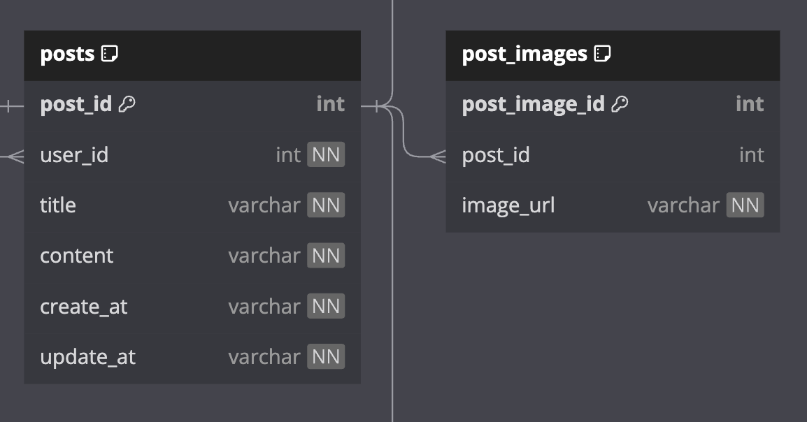

- - -

(화상 멘토링 진행하면서 자연스럽게 해결되는 문제도 있고, 크게 중요하지 않는 것 같아 생략한 문제도 있다. 기록을 위해서 삭제하지는 않고 있지만 어떠한 답변이나 정리된 정보를 얻고 싶다면, [2주차 - 멘토링 피드백 & 질문 답변](flab/week2/2주차%20-%20멘토링%20피드백%20&%20질문%20답변.md)을 보자)

##### 1. 검색 시 여러 도메인의 조건을 사용하고 싶다. (ex: 사용자 이름, 해시태그, 글 제목/내용)

- Q. 각 도메인의 api에 검색 기능을 추가하는 것보다 검색 전용 api와 기능을 만드는게 좋다고 생각하는데, 어떻게 처리하는게 좋을까? (실제로는 어떤 식으로 처리하는가?)
- Q. 코드 설계를 할때 search 도메인 패키지를 따로 만들어야 할까?
- (아마 이 부분 구현은 나중에 엘라스틱서치 같은 서비스를 사용해서 개선해야 할 것 같다.)

##### 2. `create_at`, `updated_at`, `deleted_at`은 필수적인가?

- Q. 관련해서 찾아보다가 괜찮은 [답변](https://www.reddit.com/r/Database/comments/t226up/created_at_updated_at_from_date_thru_date_on/)을 찾았는데, 이 의견이 적절한지? 

이하 답변
>   A good lens to view it through is cost/risk/benefit.
>   1. If you don't record when an entity is created, you can't go back and fill in that data later. So you risk not being able to audit, correlate, or sort the data. Which is all very important in most contexts.
>   2. If you don't record when an entity is updated, the risks are similar. But context dependent this timestamp may be less useful, especially if the entity isn't user-editable.
>   3. Timestamp for deleted data take significantly more effort than created/updated.
>   4. It's easy to just add the created/updated timestamps up front. (In terms of developer effort it's always easier to add them up front, then introduce them later.)
>   5. If they end up not being useful, removing them is easy.
>   6. These timestamps use a negligable amount of data/storage space compared their value.
>   7. They tend to be most valuable on frequently updated data. (Which are also usually the largest, in terms of row count.)
>   8. Looks at the risks of what could go wrong, or you could be held liable for if an authorized user modified the data.
>   9. Think about how those timestamps could be used by data scientists to analyze user behavior, find problems, and improve the platform.

> 비용/위험/이익이라는 관점에서 볼 수 있습니다.
> 엔티티가 생성될 때 기록하지 않으면 나중에 돌아가서 해당 데이터를 채울 수 없습니다. 따라서 데이터를 감사하거나, 상관관계를 파악하거나, 정렬할 수 없게 될 위험이 있습니다. 이는 대부분의 상황에서 매우 중요합니다.
> 엔티티가 업데이트되는 시점을 기록하지 않는 경우에도 위험은 비슷합니다. 그러나 상황에 따라 이 타임스탬프는 특히 사용자가 편집할 수 없는 엔티티인 경우 유용성이 떨어질 수 있습니다.
> 삭제된 데이터에 대한 타임스탬프는 생성/업데이트된 데이터보다 훨씬 더 많은 노력이 필요합니다.
> 4. 생성/업데이트된 타임스탬프를 미리 추가하는 것이 더 쉽습니다. (개발자의 노력 측면에서는 항상 미리 추가한 다음 나중에 도입하는 것이 더 쉽습니다.)
> 5. 타임스탬프가 유용하지 않게 되면 쉽게 제거할 수 있습니다.
> 6. 타임스탬프는 그 가치에 비해 데이터/저장 공간을 무시할 정도로 많이 사용합니다.
> 7. 자주 업데이트되는 데이터에서 가장 유용합니다. (행 수 측면에서도 일반적으로 가장 큰 데이터입니다.)
> 8. 권한이 있는 사용자가 데이터를 수정했을 때 잘못될 수 있는 위험 또는 책임을 져야 할 수 있는 위험을 살펴봅니다.
> 9. 데이터 과학자가 사용자 행동을 분석하고, 문제를 찾고, 플랫폼을 개선하기 위해 이러한 타임스탬프를 어떻게 사용할 수 있는지 생각해 봅니다.

[추가: 외래키 관련한 질문](https://dataedo.com/blog/why-there-are-no-foreign-keys-in-your-database-referential-integrity-checks)
##### 3. soft delete는 왜 사용하며, 어떻게 구현하고 사용되는가?

- 찾아본 바에 의하면 2가지가 주요 이유인 것 같다.
	- 1. 데이터 처리 속도를 빠르게 (hard delete는 인텍스,테이블 수정이 발생함)
	- 2. 데이터 보존, 히스토리 추적 용도 
- Q. 2가지 이유가 실제로도 맞는지? 이유가 더 있다면 무엇인지?
- Q. soft delete 된 데이터는 언제 삭제하는가?

##### 4. 시간 정보를 포함하는 ID를 사용하면 `create_at` 는 필요없는가?

- 이전에 프로젝트에 간단한 채팅 기능을 만든 적이 있다.
	- index 조건과 한 row가 가지는 데이터 양을 줄이고 싶어서 시간 정보를 포함하는 7 버전 UUID를 사용했었다.
		- `chat_idx(room_id, create_at, chat_id)` -> `chat_idx(room_id, chat_id)`
	- MongoDB를 보면 ObjectID에도 시간 정보를 사용하는 것 같다.
- Q. 그렇다면, 시간 정보를 포함하는 ID를 사용하면 `create_at`을 사용하지 않아도 되는가?
	- 정확히는 MongoDB ObjectID를 사용한다면, `create_at`을 추가하지 않는가?
- Q. 실무에서도 시간 정보를 포함하는 ID를 의도적으로 사용하는 경우가 있는가?
	- 추측하기로는 채팅이나 SNS(ex: Snowflake ID)같은 분산처리를 사용하고 (DB가 분리되어 increment long 타입 불가능) 제한적인 부분에서만 쓰이는 것 같다.
		- 시간 순 정렬 + 분산 서비스에서 유효한 ID가 필요한 경우

##### 5. 클라우드 스토리지 관리

- Q. 클라우드 스토리지에서 더 이상 사용하지 않는 데이터는 삭제하는가? 아니면 분석을 위해서 남겨두는가?
- Q. 만약 삭제한다면, "더 이상 사용하지 않는 상태"인 건 어떻게 확인하는가?

##### 6. ERD Post 피드백



현재 이런 구조를 가진다.

- Q. post의 content에도 image_url이 포함이 되는데, 굳이 post_image로 뺄 필요가 있는지?
	- 인스타 같이 SNS의 한 게시물에 여러 이미지와 내용이 따로 있는 경우면 이 구조가 맞겠지만, 지금은 오히려 비정규화가 되는 것 같다.

##### 7. 프로젝트 코드 패키지 구조에 관해서

- Q. 도메인 단위로 패키지를 나누는 편인데, "도메인"의 기준을 잘 모르겠다.
	- 지금까지는 생명주기(생성,삭제)가 동일한 경우로 분리했는데, 너무 많이 분리되는 것 같다는 느낌을 받는다.
	- 현재 구상하는 프로젝트만 해도 post, user, reply, bookmark, follow, hashtag로 총 6개다.
	- Q. 인터넷을 보다보면 DDD를 통해서 도메인을 분석하고 정리한다는데, 실제로는 어떻게 분석하는지?
	- Q. 이러한 도메인 설계 관련해서 추천할만한 자료나 책이 있는지?
	- 참고 이미지 

- Q. 지금 아래와 같은 패키지 구조를 생각하고 있다. 너무 복잡한지? 보았을 때, 어떤 느낌이 드는지?

```
.
├── api
│   ├── config
│   ├── post
│   │   └── PostOOController
│   ├── user
│   └── reply
│   └── ...
├── core
│   ├── config
│   ├── post
│   │   ├── PostOOService
│   │   ├── PostOOServiceImpl
│   │   ├── PostOORepository 
│   │   ├── PostOOEntity
│   ├── user
│   ├── reply
│   ├── exception
│   └── ...
└── infrastructure
    ├── security
    ├── exception
    │    └── handler
    ├── monitoring
    └── logging
```


번외 - 개인적으로 가장 마음에 들어하는 구조, 다만 도메인과 엔티티 모델이 따로 있어야 해서 잘 사용하지 않는다.
```
.
├── api
│   ├── post
│   │   └── PostOOController
│   ├── user
│   └── reply
│   └── ...
├── core
│   ├── post
│   │   ├── PostModel
│   │   ├── PostOOService
│   │   ├── PostOOServiceImpl
│   │   └── PostOORepository (interface only)
│   ├── user
│   ├── reply
│   ├── exception
│   └── ...
├── persistence(or db)
│   ├── post
│   ├── user
│   ├── reply
│   ├── util
│   └── ...
└── infrastructure
    ├── security
    ├── exception
    │    └── handler
    ├── monitoring
    └── logging
```