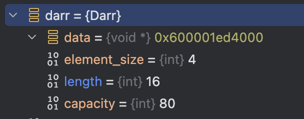
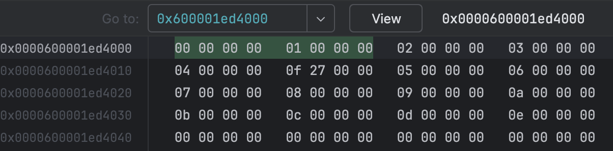

# 배경
### ADT 찾기

[위키피디아](https://en.wikipedia.org/wiki/Abstract_data_type#Common_ADTs)에서 ADT에 대한 설명을 찾을 수 있다.
#### ADT란?
Abstract data type의 약자로, 데이터와 데이터를 조작하는 방법을 정의하는 고수준의 데이터 모델이라고 한다.

클래스의 기반이 되는 개념으로, 그냥 외부에서 보는 클래스의 요구사항을 정리한 것이라고 보면 된다.

### 계획

앞으로 구현할 여러 자료구조의 ADT를 찾아서 정리하고, 해당 ADT를 C로 구현할 것이다.

간단하고 구현이 쉬운 것부터 순차적으로 진행할 계획이다.

순서는 구체적으로 정하진 않고, 그냥 그때그때 확인하고 구현할 것 같음.

대신 만든 순서대로 정리할꺼니까 목차를 보면 진행 순서를 확인할 수 있다.

각 자료구조는 다음과 같은 순서로 진행할 예정.    
`ADT 정리 -> 구현 -> 테스트(테스트 코드 작성) -> 로깅 기능 추가 -> 시각화(파이썬)`

또한, 각 자료구조는 별도의 모듈로 분리하여 외부에서 사용할 수 있도록 한다. (`python`의 `heapq` 같은 느낌으로 만든다.)


로깅 기능은 처음 구현할 때, 성능 부분에서 문제가 발생하지는 않는지 따로 검증해야 함.

로깅 기능과 시각화 기능은 비슷한 부분이 많은 것 같아 모듈로 분리하고, 설명도 따로 하는게 좋을 것 같음.

# 구현

## 동적 배열(Dynamic Array)

[동적 배열 위키피디아](https://en.wikipedia.org/wiki/Dynamic_array)

Array는 Random access를 제공하는 연속된 메모리를 가지는 ADT를 의미한다.

### ADT 정리하기

다음은 GPT가 정리한 내용이다.

1. **Initialization (Create)**
    - Initializes an empty dynamic array.
    - 빈 동적 배열을 초기화합니다.
2. **Add (Append)**
    - Adds an element to the end of the dynamic array.
    - 동적 배열의 끝에 요소를 추가합니다.
3. **Insert**
    - Inserts an element at a specified index.
    - 지정된 인덱스에 요소를 삽입합니다.
4. **Delete (Remove)**
    - Removes the first occurrence of a specified element.
    - 지정된 요소의 첫 번째 발생을 제거합니다.
5. **Delete at Index (Pop)**
    - Removes the element at a specified index.
    - 지정된 인덱스의 요소를 제거합니다.
6. **Access (Get)**
    - Retrieves the element at a specified index.
    - 지정된 인덱스의 요소를 가져옵니다.
7. **Update (Set)**
    - Updates the element at a specified index.
    - 지정된 인덱스의 요소를 업데이트합니다.
8. **Size**
    - Returns the number of elements in the dynamic array.
    - 동적 배열의 요소 수를 반환합니다.
9. **Capacity**
    - Returns the current capacity of the dynamic array.
    - 동적 배열의 현재 용량을 반환합니다.
10. **Is Empty**
    - Checks if the dynamic array is empty.
    - 동적 배열이 비어 있는지 확인합니다.

### 구현하기

조건은 다음과 같다.
1. 연속된 메모리 구조를 가지며 랜덤 액세스가 가능해야 한다.
2. 다양한 타입을 지원해야 한다.

[구현한 커밋 링크](https://github.com/YangSiJun528/data_structure_with_c/commit/d1403d9602819e08cb3e9e4ea773a84285b385f7)

자세한 구현은 깃헙 커밋을 참고하고, 글로는 왜 이렇게 구현했는지만 설명한다.

이번 구현은 GPT를 조금 참고했는데, 메모리 다루는게 익숙하지 않아서 그랬다. 이후에는 안보고 할 예정 (만약 사용했으면 지금처럼 설명할꺼임)

다양한 타입을 위해 구조체에 void 포인터를 가지는 영역을 할당하고, 그 영역에 배열 데이터를 추가하는 식으로 구현하였다.
또한, 여러 타입을 지원하기 위해서 요소의 사이즈를 생성 시 입력받는다.
```c
typedef struct {
    void *data;         // 데이터 포인터
    int element_size;   // 요소의 크기
    int length;         // 현재 크기
    int capacity;       // 용량
} Darr;

Darr darr_create(int element_size);
void darr_add(Darr *darr, void *element);
void darr_insert(Darr *darr, int index, void *element);
void darr_update(Darr *darr, int index, void *element);
void darr_delete(Darr *darr, int index);
void* darr_get(Darr *darr, int index);
int darr_length(Darr *darr);
void darr_free(Darr *darr);
```

add와 insert나 pop나 delete가 분리된 이유는 다음과 같다.
1. 효율성: **`add`와 `pop`**: 배열의 끝에서 작업을 수행하는 함수이므로, O(1)의 효율적인 연산이 가능핟.
2. 동적 배열 특징: 동적 배열은 끝이 없는 배열처럼 사용되지만, 실제로는 메모리 제한이 있다. 배열의 크기를 확장하거나 줄이는 연산이 필요한데, 이를 `add`와 `pop`가 담당한다.

(이러면 사실 상 스택도 구현한 거 아닌가?)

주의할 점은, thread-safe 하지 않은 자료구조이다.

#### 리틀 엔디안 확인하기

기능 구현 테스트를 하다가, 메모리 값을 까서 보는데, 맥북 M1(ARM) 을 사용하고 있어서 그런가. 리틀 엔디안으로 데이터가 저장되고 있는 것을 확인했다.


void 포인터이므로 값을 IDE에서 바로 확인할 수 없고, 메모리 주소를 까서 봐야 한다.


다음과 같은 메모리 값을 가진다.  (`0 1 2 3 4 9999 5 6 7 8 9 10 11 12 13 14`)

ARM은 리틀 바이트 오더이므로 저장 순서가 일반적으로 사람이 생각하는 생각과 반대로 되어 있다. 

`0f 27 00 00`는 실제로 읽을 때, `00 00 27 0f` 로 가져와진다.

불필요한 부분을 제거한 16진수 `270f`를 10진수로 변환하면, `9999`가 된다.

### 테스트 코드

(연산 테스트마다 각자 독립적이지 않기는 한데... 사이사이에 검증하니까 괜찮지 않을까? 좋은 테스트 코드는 아닌거 같긴 한데, 나중에 기회 되면 바꾸던가 하고)

[구현 커밋 링크](https://github.com/YangSiJun528/data_structure_with_c/commit/d1403d9602819e08cb3e9e4ea773a84285b385f7)

- 단순 동작 확인 테트스 코드 
- 성능 테스트 코드 

### 결과


다음과 같은 결과가 나왔다. 수행 시간이 다 0.0000N 대라서 p1~p99가 잘 분포되어있지는 않다.
(아니면 GPT로 구현한 분석+시각화 코드가 잘못되었거나.)

- `get` 연산이 랜덤 액세스를 통해 O(1)로 수행
- `add` 연산도 O(1)으로 보인다. resize 때문에 p99가 낮게 나올 수도 있다고 생각했는데, 데이터 개수가 적어서인지, 그렇지는 않다.
- `pop` - 당연하게 O(1), 값을 제거하지 않고 `length`를 1 감소시킨다.
- `insert`/`delete` - 기존 데이터의 이동이 발생하는 연산이라 O(n)이다. 추가하는 위치를 인덱스 0번, 중간, 끝부분 으로 나눠서 실행해서 그런지, 연산 소요 시간이 오래 걸렸다.
- `update`는 기능 구현을 까먹고 나중에 추가해서, 성능 테스트에는 없다. 다만 get + 포인터가 참조하는 값 수정 로직이기 때문에 O(1)일 것이다.

## Deque(double-ended queue, 덱) - 중도 포기
Deque 구현 이유: Stack이랑 Queue 따로 할까 했는데, Stack은 동적 배열이랑 거의 똑같고, Queue나 Deque나 구현 난이도가 비슷한거 같았다.

#### 구상
찾아보니 주로 2가지 방법이 쓰이는 것 같다.
- Circular Array: front, rear 포인터를 조절하는 방식
	- Resize가 필요, (효율적인) 연속된 메모리 공간, 랜덤 접근에 유리
- Linked List-Based Queue: 새로운 노드를 연결하거나 끊는 방식
	- (데이터의 중간에도) 삽입/삭제의 성능이 좋음. 동적 크기 조절에 유리. 더 많은 메모리 (Node 때문) 사용
- (비추) Stack 2개 사용: 다른 방식에 비해 비효율적임. 스택이 비면 데이터를 옮겨줘야 한다.

- AI 피셜 언어별 구현 (나중에 쓸거면 검증 필요)
	- C++
		- `std::deque`: 원형 배열과 이중 연결 리스트의 혼합
	- Java - `java.util.Deque` 구현체들
		- `ArrayDeque`: 원형 배열
		- `LinkedList`: 이중 연결 리스트
	- Python
		- `collections.deque`: 이중 연결 리스트
	- JavaScript/Go
		- 기본 구현 없음 (기능 여부가 아니라 효율(시간 복잡도)관점)
	- Rust
		- `VecDeque`: 원형 배열

#### 결론: Circular Array로 구현하기

어차피 Linked List 구현 방식은 나중에 Linked List 만들어 보면 알 수 있으니까, 안해본 Circular Array를 쓰기로 함.

#### 구현

원형 배열을 구현하는게 처음이고, 동적 배열 기능도 추가하는 것 때문에 여러 번 갈아 엎어서 단순 구현만 10시간 이상 걸린 것 같다... (resize 문제 해결하는데 3시간을 썼다.)

원형 배열 구현은 다른 언어로도 해본 적이 없어서, 직접 그림을 그려가면서 구현하였다.

```c
typedef struct {  
    void *data;     // 정적 배열 포인터  
    int front;      // 원형 큐의 front가 되는 정적 배열의 인덱스  
    int rear;       // 원형 큐의 rear거 되는 정적 배열의 인덱스  
    int capacity;   // 현재 할당된 요소의 개수  
    int element_size;   // 요소 한 개의 크기  
} Deque;  
  
Deque deque_create(int element_size);  
void deque_push(Deque *Deque, void *element);  
void* deque_pop(Deque *Deque);  
void deque_push_left(Deque *Deque, void *element);  
void* deque_pop_left(Deque *Deque);  
void* deque_get(Deque *Deque, int index);  
int deque_length(Deque *Deque);  
void deque_free(Deque *Deque);
```

"rear는 항상 추가하고 이동한다. front는 이동하고 추가한다."는 규칙을 정하고 개발했다. 둘 다 추가하고 이동하는 식이면 값이 덮어씌워질 수 있기 때문이다.

근데 이 규칙 때문에 개발을 진행하는데 문제가 있었다. resize 기능 구현에서 문제가 있었는데, 원인 파악을 못하고 3시간 동안 해맸다.

겪은 문제들...

```
6 5 4 3 2 1 0 
7 6 5 4 3 2 1 0 
8 7 6 5 4 3 2 1 0 
9 0 8 7 6 5 4 3 2 1 0 << resize 이후 0이 사이에 들어감
10 9 0 8 7 6 5 4 3 2 1 0 
11 10 9 0 8 7 6 5 4 3 2 1 0 
```

```
6 5 4 3 2 1 0 
7 6 5 4 3 2 1 0 
8 7 6 5 4 3 2 1 0 
9 8 7 6 5 4 3 2 1 0 0 << 0이 추가됨
10 9 8 7 6 5 4 3 2 1 0 0 
11 10 9 8 7 6 5 4 3 2 1 0 0 
```

또 예상치 못한 부분은 pop인데, 포인터를 사용해서 내부 배열의 일부 주소를 반환한다. (get도 포함되는 이야기기는 함.)

이 경우 내부 배열을 참조하고 있다. 값이 덮어씌워질 수 있다.

그래서 pop 한 뒤에 push하면 결과가 바뀌어 버린다.

근데 해결하려면 `molloc`을 사용해서 별도의 주소를 할당받고 반환해주어야 한다.   
하지만 이 경우 시스템 콜이 포함되서... 성능에 영향을 줄 수 있다고 생각해서 하지 않았다. (다른 언어들은 제네릭 기능이 있으니까 상관없는데)

이런 문제가 더 생길거 같아서, 다음부터는 포인터 쓰지 말고 TYPE 매크로를 사용해서 구현할 생각이다.

지금 구현에도 10시간이 넘게 걸려서, 우선 이 코드는 성능테스트 없이 (불완전하긴 하지만) 기능 테스트만 해보고 멈추기로 했다.

# 로깅

### 구상

~~그냥 라이브러리 쓸 생각.
`spdlog`가 되게 star 수도 22k로 많고, 관리도 다른 라이브러리에 비해 잘 되는거 같아 채택함.
C++용으로 나온거긴 한데, C도 지원한다고 함.~~

~~파일로 남기고, 이 파일을 파이썬이 읽는 식으로 구현할 것.~~

~~아마 `시간 - 작업 - 기타 정보` 순으로 계속 남기고, 이걸 읽어서 처리하게 하지 않을까?
아니면 데이터를 JSON으로 가공하고 쓴다거나...~~

~~시간을 어떻게 효율적으로 처리할 건지가 중요할 듯?~~

라이브러리 쓰려고 했는데, `gradle`이나 `npm`처럼 의존성 관리가 쉽지 않다.

`FetchContent`나 `ExternalProject`를 사용해야 하는데, 복잡해서 다른 방법을 찾아보기로 했다.

GPT에게 물어보니 `syslog.h`를 사용하면 된다고 한다.

그래서 사용하도록 구현했는데, 로그가 남지 않았다. 다른 방법을 찾아보니 macOS에서는 `os/log.h`를 사용해서 로그를 남기는걸 권장한다고 한다. `os/log.h`를 사용해보니 로그가 잘 남았다.

apple에서 제공하고, 아마 내부적으로도 쓰일 것 같아서 성능 문제는 크게 없을 것 같아, [`os/log.h`](https://opensource.apple.com/source/xnu/xnu-3789.21.4/libkern/os/log.h.auto.html)를 사용하기로 했다.

걱정되는 부분은 로그 데이터가 충분히 많은 양을 저장할 수 있는지인데, 우선 해보고 안되면 다른 방식으로 구현할 계획이다.

왜 로그로 저장하고 파일로 바로 쓰지 않는지 궁금해할 수 있을거 같은데, 성능 때문이다.    
내가 구현한 파일 쓰기 기능이 연산 시간에 영향을 주지 않는다고 확신할 수 없다(C 같은 로우레벨이 익숙하지 않기도 하고).     
그래서 상대적으로 잘 구현된 믿을만한 라이브러리를 사용하고, 파일 저장을 다른 시점에 수행하기로 했다.


### 구현

아마 특정 함수마다 걸리는 시간을 검사할 거 같음.

`데이터 수 + 작업 종류 + 작업에 걸리는 시간`을 로그로 남길거 같은데, 이 로적이 반복될거 같음.

함수 포인터를 사용해서 AOP처럼 구현할 수 있지 않을까?

어차피 로그는 테스트 코드에서만 남길꺼니까.

따로 실행 시간 테스트용 모듈을 만들고, 실행할 함수를 넣어서 호출하는 식으로...

GPT를 통해서 코드를 구현했다.

매크로를 사용해야면 인자의 타입으로 모든 타입이 들어올 수 있도록 유연성을 제공할 수 있었다.

인라인 함수도 고려해보았지만, 호출할 함수의 인자의 타입을 정하는게 복잡했음

#### 코드

[PR](https://github.com/YangSiJun528/data_structure_with_c/pull/1)에서 보기

##### os/log 테스트

로그가 잘 남겨지는가를 확인하기 위한 테스트 코드 작성. 1억개 정도로 확인해봤는데, 큰 문제 없이 잘 작성되었다.

근데 어느정도 delay를 걸어주지 않으면 로그가 정상적으로 남지 않는다.

```c
#include <os/log.h>  
  
int main() {  
    os_log_t logger = os_log_create("com.myapp", "default");  
  
    // 작업 시간 측정 및 로그 기록 - 1억 반복  
    for (unsigned long long i = 0; i < 1000000; ++i) {  
        os_log(logger, "count: %llu", i);  
        usleep(100); // 0.1밀리초 지연  
    }  
  
    // 프로그램 종료 전에 로그가 완전히 기록되도록 잠시 대기  
    sleep(5);  
  
    return 0;  
}
```

실제 코드에서는 수행 시간이 있으니까 괜찮을 것 같긴 함.

그리고 이러면 로그가 console 앱에 남는데, 따로 파일로 읽을 수는 없다.

`log` 명령어를 사용해서 별도의 파일로 가져와야 함.

`log show --predicate 'subsystem == "com.myapp"' --info > log_file`

여러 번 테스트를 했는데, 독립적인 로그만 읽기 위해서 subsystem 이름을 많이 바꾸면서 실행했었음.

`--info`는 logger level, `--debug` 와 같이 다른 옵션도 있다.

다만 아쉬운 점은, 함수 호출 시 파라미터 값을 확인하기 어렵다는거...

#### 참고한 GPT의 대답

https://gist.github.com/YangSiJun528/1e6ec3bdcc02627f128563df36e3c68e

### [추가] 로그 파일로 저장하기

매번 명령어를 사용해서 읽는게 불편하므로, 로그를 읽어서 파일로 저장하는 기능을 구현하기로 함.

#### 기능 정의

1. log 명령어를 호출 (이때, subsystem이나 logging level은 외부에서 호출 시 조절 가능)
2. 결과를 읽어서 파일로 저장

왜 로그 작성 시 따로 파일에 저장하지 않는가?    
-> 이 경우, 파일 쓰기 연산이 추가되는데 성능에 영향이 갈 거라고 생각함. 로그 남기는거야 애플이 구현한 API를 사용하면 되는거지만, 파일에 쓰기 연산은 성능에 어떤 영향을 줄 지 모르니까.

#### 구현

[구현한 커밋](https://github.com/YangSiJun528/data_structure_with_c/commit/7b8da635ab365329e1a07b2797d03360182dce35)을 참고하기

# 시각화

프로젝트의 핵심이 아니기도 하고, GPT 사용해서 구현하였기 때문에, 구현에 대한 설명은 생략하겠다.

[다음 커밋](https://github.com/YangSiJun528/data_structure_with_c/commit/4d59c6dcc4f89d7215c3be35bf793f4a85092ea8)에서 구현하였다. (지금 실행에 약간 문제가 있는 것 같기도 해서, 나중에 구현이 변경될 수 있다.)

- 구성
	- `parse_log_to_json.py`
		- `.log` 형식인 로그 데이터를 분석이 편한 `json` 형태로 변경
	- `json_log_analyze.py` 
		- `json` 형태의 로그를 읽고 분석해서 시각화